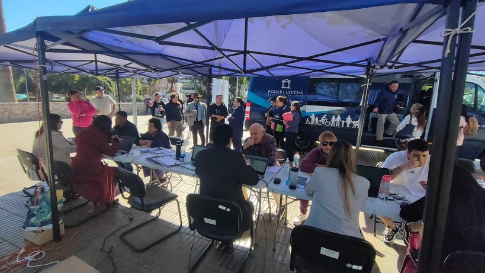

Title: El Bus de la Justicia Recorre la Jurisdicción para Acercar los Servicios Judiciales a la Ciudadanía
Date: 2025-05-30 16:00
Category: Informática, Mantenimiento
Slug: bus-de-la-justicia-2025
Authors: Corporación Administrativa
Summary: El Bus de la Justicia visitó distintas localidades de la jurisdicción durante la última semana de mayo, ofreciendo orientación legal gratuita a la ciudadanía en materias de familia, civil, laboral y penal.

**Copiapó, 30 de mayo de 2025** – En una nueva muestra del compromiso del Poder Judicial con la comunidad, el **Bus de la Justicia** recorrió diversas localidades de la jurisdicción durante la semana del 26 al 30 de mayo, ofreciendo **orientación y atención jurídica gratuita** a la ciudadanía.

El itinerario contempló las siguientes fechas y lugares:

- **26 de mayo**: Frontis de la Municipalidad de Copiapó  
- **27 de mayo**: Plaza de Vallenar  
- **28 de mayo**: Frontis de la Municipalidad de Tierra Amarilla  
- **29 de mayo**: Plaza de Caldera  
- **30 de mayo**: Consultorio de Paipote  

El objetivo principal de esta iniciativa es **acercar la justicia a las personas**, permitiendo que profesionales especializados en materias **de familia, civil, laboral y penal** entreguen asesoría directa a los vecinos, resolviendo dudas y orientando sobre los trámites judiciales disponibles.

Durante la jornada también se distribuyeron **folletos informativos**, con el fin de que la comunidad cuente con material de apoyo claro y accesible sobre los diversos servicios del Poder Judicial.

En esta actividad participaron, por parte del área de informática, los funcionarios **Víctor Quevedo, Daniel Caminada y Carlos Carrasco**, quienes apoyaron el despliegue tecnológico del operativo. Desde el área de mantenimiento, **Camila Acevedo** colaboró activamente en las labores logísticas, facilitando el correcto funcionamiento del recorrido en cada localidad.

> *“El Bus de la Justicia representa una instancia concreta para estar más cerca de las personas y garantizar el acceso a la justicia de manera inclusiva y descentralizada”*, señalaron los organizadores del recorrido.

Con esta iniciativa, el Poder Judicial continúa consolidando su rol social, garantizando un acceso efectivo a la información y servicios judiciales a lo largo de la región.

