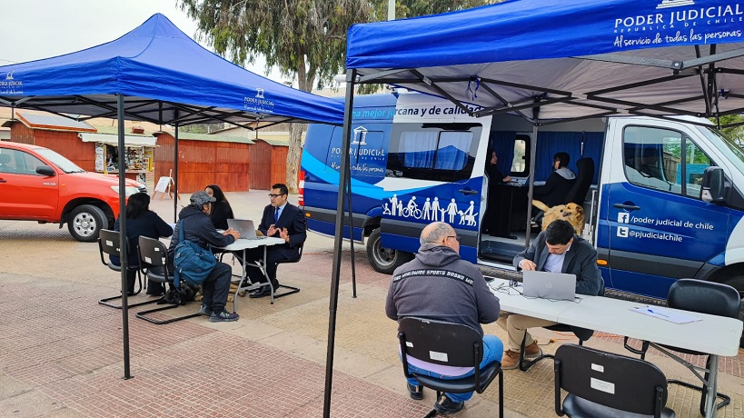

Title: Informático de la Zonal Apoya Presencialmente al Bus de la Justicia en Caldera
Date: 2024-11-13 10:30
Category: Informática
Slug: bus-de-la-justicia-noviembre
Authors: Corporación Administrativa
Summary: Hoy, en un esfuerzo por acercar los servicios de justicia a la comunidad, un informático de la Zonal brindó apoyo presencial al Bus de la Justicia en la localidad de Caldera. Esta iniciativa, organizada por el Ministerio de Justicia...

Hoy, en un esfuerzo por acercar los servicios de justicia a la comunidad, un informático de la Zonal (Víctor Quevedo) brindó apoyo presencial al Bus de la Justicia en la localidad de Caldera. Esta iniciativa, organizada por el poder judicial de Chile, busca facilitar el acceso a la justicia en las zonas más apartadas de la región.

El Bus de la Justicia es un proyecto que recorre diversas localidades de Chile, ofreciendo orientación legal gratuita, asistencia judicial, y promoviendo el acceso a servicios esenciales en temas como asesoría familiar, derechos laborales, violencia intrafamiliar, entre otros. Gracias a este esfuerzo itinerante, personas de todas las edades pueden acceder a información y servicios de justicia que en ocasiones resultan lejanos o complejos de obtener.

La presencia del informático de la Zonal fue crucial para asegurar el funcionamiento técnico de los equipos y sistemas de gestión que utiliza el Bus de la Justicia en su operativo diario. Este soporte técnico permite que los procesos de atención al público se desarrollen de manera eficiente y sin interrupciones, asegurando que cada ciudadano reciba el apoyo necesario.

> "El objetivo de este tipo de asistencia es acercar la justicia a quienes más la necesitan, en especial en lugares remotos donde el acceso puede ser limitado", explicó el informático de la Zonal, quien estuvo en terreno asegurando la continuidad operativa de esta importante iniciativa.

Con cada nueva parada, el Bus de la Justicia refuerza el compromiso de ofrecer un acceso igualitario a los servicios de justicia para todos los chilenos, un paso hacia una justicia más inclusiva y cercana a la comunidad. La visita de hoy en Caldera se suma a un recorrido que continuará llegando a diversas localidades de la región, llevando consigo no solo información y asistencia, sino también un mensaje claro de compromiso con la equidad en el acceso a la justicia.

