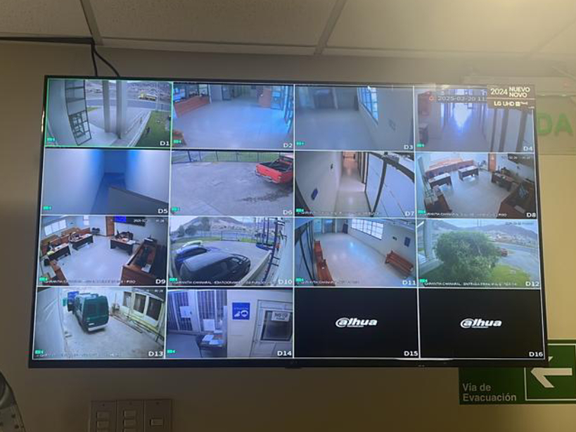

Title: Reemplazo de Smart TV en el Tribunal de Letras y Garantía de Chañaral Refuerza Seguridad en el Recinto
Date: 2025-02-20 09:30
Category: Informática
Slug: remplazo-cctv-chanaral
Authors: Corporación Administrativa
Summary: En una labor clave para la seguridad y el correcto funcionamiento de los sistemas de vigilancia, un equipo de informáticos de la Corporación Administrativa del Poder Judicial acudió al Tribunal de Letras y Garantía de Chañaral ...

**Chañaral, 20 de febrero de 2025** – En una labor clave para la seguridad y el correcto funcionamiento de los sistemas de vigilancia, un equipo de informáticos de la Corporación Administrativa del Poder Judicial acudió al Tribunal de Letras y Garantía de Chañaral para realizar el reemplazo del Smart TV vinculado al circuito cerrado de televisión (CCTV), el cual había dejado de operar.  

Este sistema es fundamental para la supervisión de los espacios tanto internos como externos del tribunal, permitiendo un monitoreo constante y contribuyendo a la seguridad de funcionarios, usuarios y bienes del recinto.  

> "El correcto funcionamiento del sistema de CCTV es esencial para garantizar la seguridad en los tribunales, asegurando una vigilancia efectiva y un resguardo permanente de las instalaciones", destacaron los informáticos a cargo de la intervención técnica.  

El equipo especializado realizó la instalación, configuración y pruebas del nuevo dispositivo, asegurando su integración con el sistema de monitoreo y validando la calidad de la transmisión en tiempo real.  

Con esta actualización, el Tribunal de Letras y Garantía de Chañaral refuerza sus medidas de seguridad, manteniendo operativos sus sistemas de vigilancia y alineándose con los estándares tecnológicos requeridos por el Poder Judicial para la protección de sus dependencias.  

