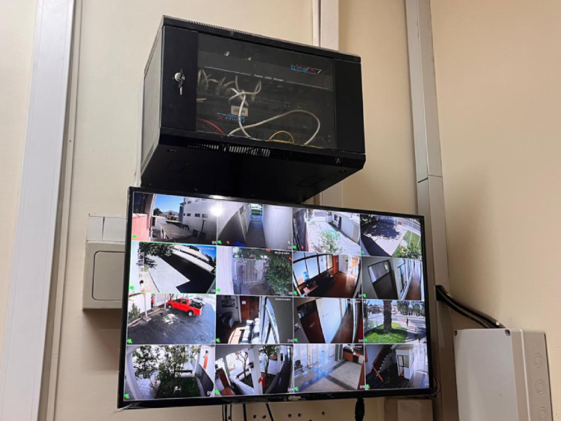

Title: Renovación Tecnológica en la Ilustrísima Corte de Apelaciones de Copiapó 
Date: 2025-02-19 10:45
Category: Informática
Slug: remplazo-cctv-ica-coppo
Authors: Corporación Administrativa
Summary: En un esfuerzo por garantizar el óptimo funcionamiento de los sistemas de comunicación y reforzar los estándares de seguridad tecnológica, un equipo de informáticos de la Corporación Administrativa del Poder Judicial ...

**Copiapó, 19 de febrero de 2025** – En un esfuerzo por garantizar el óptimo funcionamiento de los sistemas de comunicación y reforzar los estándares de seguridad tecnológica, un equipo de informáticos de la Corporación Administrativa del Poder Judicial concurrió hoy a la Ilustrísima Corte de Apelaciones de Copiapó para llevar a cabo el reemplazo de un televisor institucional, el cual presentaba fallas tras años de operación.  

El cambio del equipo responde a la necesidad de mantener las condiciones técnicas adecuadas para la visualización de información relevante en la Corte, asegurando así la continuidad operativa de los servicios y el cumplimiento de los parámetros de seguridad exigidos por la Ilustrísima Corte de Apelaciones.  

> "Este tipo de renovaciones forman parte del compromiso del Poder Judicial con la modernización de sus dependencias y la implementación de estándares tecnológicos que garanticen un servicio eficiente y seguro", señaló uno de los informáticos a cargo del procedimiento.  

El equipo técnico realizó la instalación y configuración del nuevo dispositivo, asegurando su correcto funcionamiento. Con esta actualización, la Corte de Apelaciones de Copiapó refuerza su infraestructura tecnológica, manteniéndose a la vanguardia en la implementación de soluciones digitales para el ejercicio de la justicia.  

Este tipo de intervenciones técnicas son fundamentales para el desarrollo de las labores jurisdiccionales y administrativas, garantizando que la tecnología utilizada en las dependencias judiciales se mantenga en condiciones óptimas y en cumplimiento con los estándares de seguridad y operatividad requeridos.  

