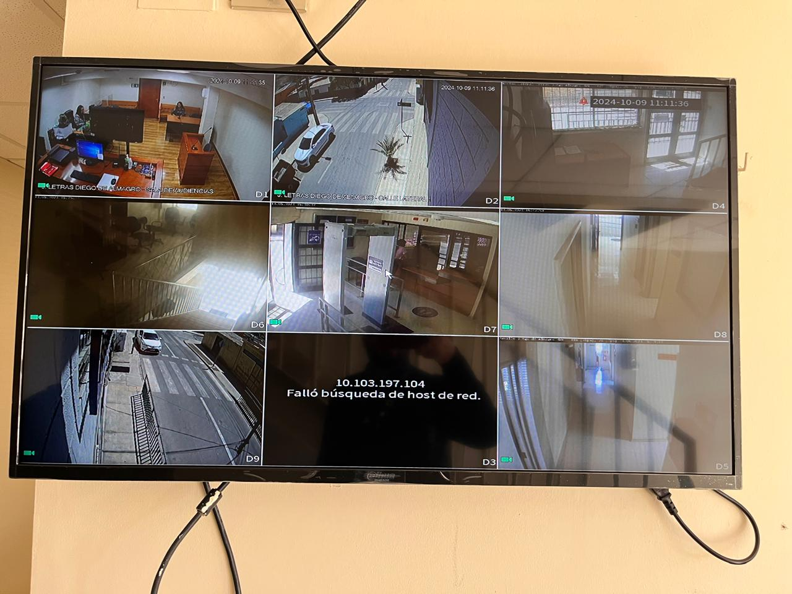

Title: Reparación CCTV en Tribunal de Letras de Diego de Almagro
Date: 2024-10-09 10:30
Category: informática
Slug: cctv-diego-de-almagro
Authors: Corporación Administrativa
Summary: El pasado **9 de octubre de 2024**, un equipo de informáticos de la zonal Copiapó se trasladó hasta el **Tribunal de Letras de Diego de Almagro** con el objetivo de realizar labores de mantenimiento y reparación.

# Reparación del CCTV en el Tribunal de Letras de Diego de Almagro

El pasado **9 de octubre de 2024**, un equipo de informáticos de la zonal Copiapó se trasladó hasta el **Tribunal de Letras de Diego de Almagro** con el objetivo de realizar labores de mantenimiento y reparación. Uno de los principales trabajos realizados fue la reparación de la **televisión del sistema de circuito cerrado de televisión (CCTV)**, que se encontraba quemada y fuera de servicio.

Durante la jornada, los profesionales también atendieron otros requerimientos de los funcionarios del tribunal, brindando soporte técnico y asegurando el correcto funcionamiento de los equipos tecnológicos.

Posteriormente, aprovechando la visita a la ciudad, el equipo acudió al **Tribunal de Garantía de Diego de Almagro** para continuar con el trabajo, atendiendo las necesidades y solicitudes de los funcionarios de esa institución.

La jornada de mantenimiento y soporte técnico fue exitosa, garantizando que los tribunales de la ciudad continúen funcionando de manera óptima y segura.
