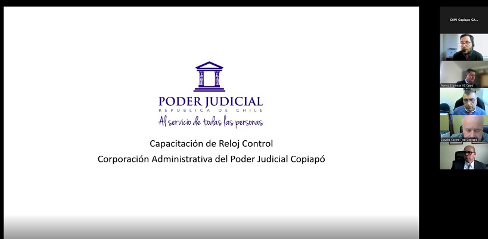

Title: Funcionarios judiciales se capacitan en instalación de software ZkTime
Date: 2025-06-19
Category: Zonal
Slug: capacitacion-zktime-junio-2025
Author: Corporación Administrativa
Summary: Funcionarios de la jurisdicción participaron en una capacitación telemática sobre la instalación y uso del software ZkTime, orientada a optimizar la gestión de datos de reloj control.

---

## Capacitación en tecnologías de control horario

El pasado *jueves 19 de junio*, se llevó a cabo una *capacitación telemática* orientada a funcionarios de las distintas unidades de la jurisdicción, con el objetivo de fortalecer las competencias técnicas en el uso del sistema *ZkTime*, herramienta utilizada para la administración y extracción de datos desde relojes control de asistencia.

La instancia formativa fue realizada por Carlos Carrasco, administrativo informático, quien entregó una exposición detallada sobre los procedimientos de instalación del software ZkTime, así como también sobre los pasos para realizar de forma correcta la *extracción de registros* desde los dispositivos instalados en las dependencias.

Durante la jornada, se abordaron aspectos técnicos esenciales, se resolvieron dudas en tiempo real y se entregó material complementario para el seguimiento posterior de la capacitación.

Esta actividad forma parte de un plan de fortalecimiento de competencias tecnológicas internas, que busca mejorar la eficiencia operativa en los procesos de control de asistencia de los funcionarios.

---
