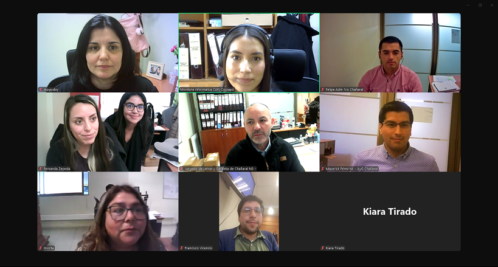

Title: Capacitación sobre Medidas de Protección y Causas de Cumplimiento "X" en SITFA Refuerza Conocimientos Funcionales en la Jurisdicción
Date: 2025-07-07 16:00
Category: Informática, Capacitación
Slug: capacitacion-sitfa-medidas-proteccion-cumplimiento-x
Authors: Corporación Administrativa
Summary: Se realizó una capacitación sobre tramitación de causas de Medidas de Protección y cumplimiento "X" en el sistema SITFA, con énfasis en la correcta aplicación de nomenclaturas y flujos de trabajo actualizados.

**Copiapó, 7 de julio de 2025** – Como parte del proceso de fortalecimiento de competencias en el uso de herramientas tecnológicas del Poder Judicial, se llevó a cabo una **capacitación telemática sobre la tramitación de causas de Medidas de Protección y cumplimiento "X" en el sistema SITFA (Sistema de Tramitación Informática Familia)**.

La jornada fue impartida por la **Monitora Informática Carolina Moreno**, a través de la plataforma **Zoom**, y estuvo enfocada en entregar una **visión general del tratamiento de causas de Medidas de Protección**, además de **detallar los flujos de tramitación correspondientes a las causas de cumplimiento "X"**, promoviendo el uso adecuado y actualizado de las nomenclaturas disponibles en el sistema.

Esta instancia formativa permitió a los participantes **reforzar criterios técnicos y operativos**, contribuyendo a una tramitación más eficaz, homogénea y alineada con los últimos lineamientos institucionales.

> *“Actualizar y profundizar conocimientos en el uso de SITFA es clave para garantizar una gestión eficiente y coherente con las normativas actuales”*, destacó la monitora a cargo.

La capacitación se enmarca en el compromiso del Poder Judicial con la **formación continua del personal**, fomentando el uso óptimo de las plataformas tecnológicas para mejorar la calidad del servicio judicial ofrecido a la ciudadanía.

