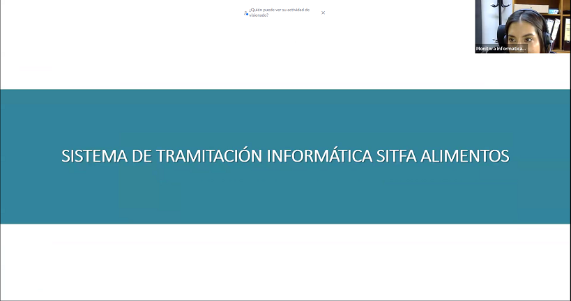

Title: Capacitación sobre Tramitación de Causas de Alimentos en SITFA Fortalece el Conocimiento Funcionario en la Jurisdicción
Date: 2025-06-27 16:00
Category: Informática, Capacitación
Slug: capacitacion-sitfa-causas-alimentos
Authors: Corporación Administrativa
Summary: En el marco del fortalecimiento de las competencias funcionarias, se realizó una capacitación telemática sobre la tramitación de causas de alimentos en el sistema SITFA, abordando nomenclaturas y mejoras recientes en la plataforma.

**Copiapó, 27 de junio de 2025** – Con el objetivo de reforzar los conocimientos técnicos y operativos de los funcionarios judiciales, se llevó a cabo una **capacitación telemática sobre la tramitación de causas de alimentos en el sistema SITFA (Sistema de Tramitación Informática Familia)**.

La actividad fue impartida por **Carolina Moreno M.**, quien guió la jornada con una **visión general del proceso de tramitación de causas de alimentos**, poniendo especial énfasis en la **correcta aplicación de las distintas nomenclaturas** disponibles en la plataforma. Además, se presentaron las **últimas mejoras implementadas en SITFA**, orientadas a facilitar la labor diaria y optimizar la gestión judicial en materia de familia.

La capacitación se enmarca dentro de las acciones formativas que buscan **mejorar la eficiencia y estandarización de los procedimientos en el Poder Judicial**, asegurando una utilización adecuada y actualizada de las herramientas informáticas institucionales.

> *“Instancias como esta permiten mantener al día los conocimientos de los funcionarios, asegurando un uso efectivo del sistema y una mejor atención a los usuarios del servicio judicial”*, señaló Carolina Moreno.

Este tipo de actividades demuestra el compromiso institucional con la **capacitación continua y el perfeccionamiento profesional**, pilares fundamentales para enfrentar los desafíos de la transformación digital en el ámbito judicial.

