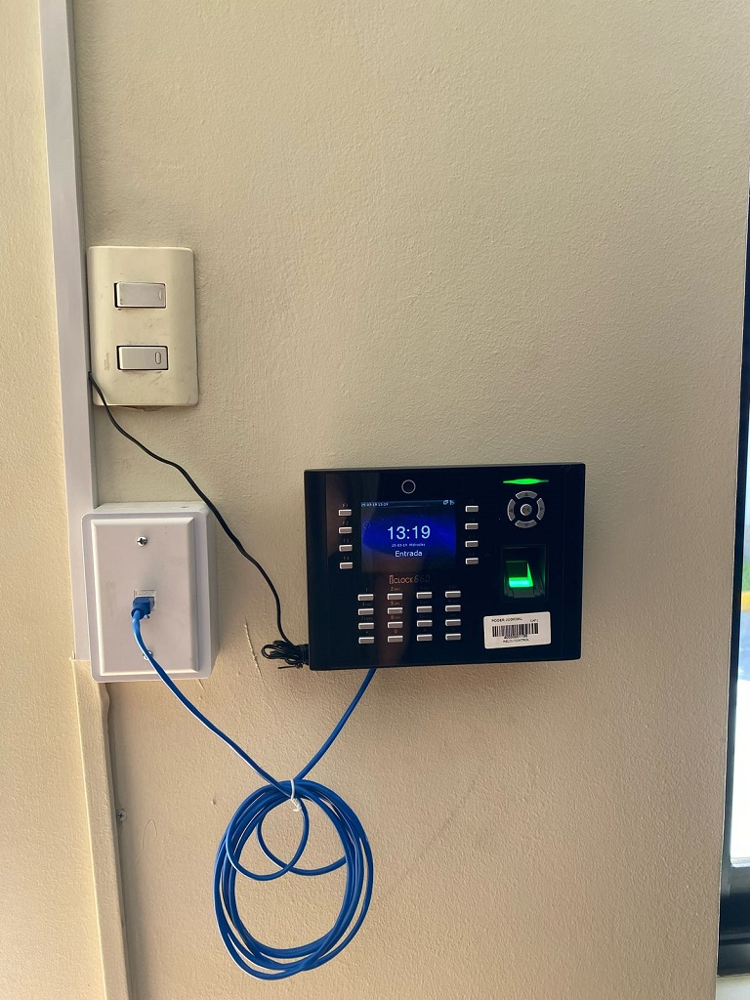

Title: Instalación de Reloj Control en la Corte de Apelaciones de Copiapó Marca el Inicio de un Proyecto de Modernización en la Jurisdicción 
Date: 2025-03-19 16:00
Category: Informática, Mantenimiento
Slug: reloj-control-ica
Authors: Corporación Administrativa
Summary: En el marco de las iniciativas de modernización y optimización de la gestión administrativa en el Poder Judicial, se llevó a cabo la instalación de un nuevo reloj control en la Ilustrísima Corte de Apelaciones de Copiapó ...

**Copiapó, 19 de marzo de 2025** – En el marco de las iniciativas de modernización y optimización de la gestión administrativa en el Poder Judicial, se llevó a cabo la instalación de un **nuevo reloj control** en la **Ilustrísima Corte de Apelaciones de Copiapó**.  

La implementación de este sistema busca **agilizar el registro de asistencia de los funcionarios**, mejorando la precisión en los tiempos de gestión y la generación de reportes administrativos. Este avance **marcará un antes y un después en la administración del recurso humano**, permitiendo un monitoreo más eficiente y transparente de la jornada laboral.  

Para la ejecución de este proyecto, que abarcará toda la jurisdicción, participaron el informático **Daniel Caminada** y, por parte del área de mantenimiento, **Felipe Manquecoy**, quienes fueron los encargados de la instalación y puesta en marcha del sistema en la Corte de Apelaciones, dando así inicio a este ambicioso plan de modernización.  

> *"Este nuevo sistema permitirá optimizar los procesos administrativos y mejorar la eficiencia en la gestión del tiempo, beneficiando tanto a los funcionarios como a la administración judicial en su conjunto,"* destacaron los especialistas a cargo de la instalación.  

El proyecto contempla la implementación progresiva de esta tecnología en los distintos tribunales de la jurisdicción, con el propósito de **homogeneizar y digitalizar los registros de asistencia**, asegurando un control más eficiente y una administración acorde a los desafíos de la transformación digital en el Poder Judicial.  

Con esta iniciativa, la Corte de Apelaciones de Copiapó se posiciona a la vanguardia en la modernización de sus sistemas internos, garantizando herramientas tecnológicas que faciliten la labor diaria y contribuyan al fortalecimiento institucional del Poder Judicial.  

