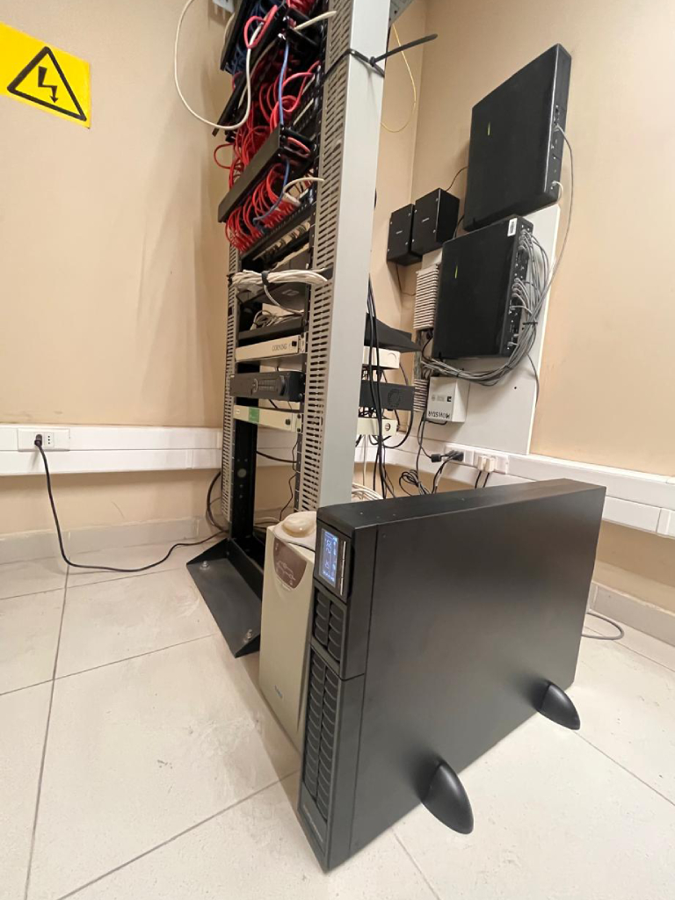
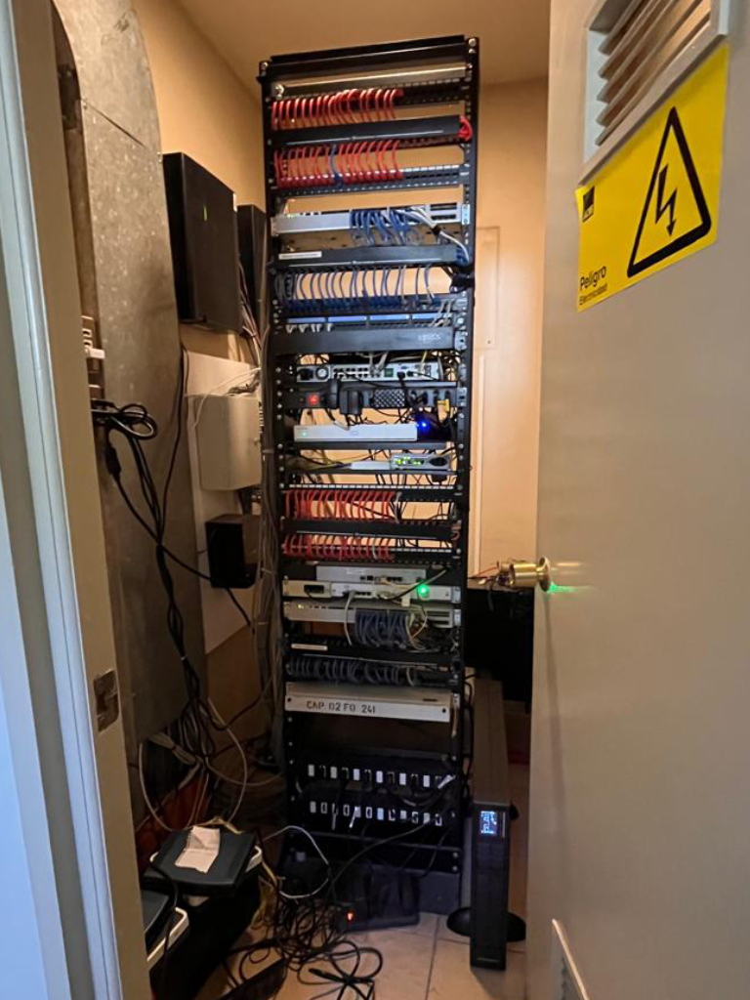

Title: Implementación de Sistemas de Respaldo Energético Refuerza la Continuidad Operativa en Tribunales de la Región
Date: 2025-03-12 08:35
Category: Informática
Slug: ups-rack-comunicaciones
Authors: Corporación Administrativa
Summary: Con el objetivo de garantizar la continuidad operativa de los tribunales y proteger los equipos críticos en las salas de comunicaciones, los informáticos de la Corporación Administrativa del Poder Judicial realizaron la instalación ...

**Vallenar, 12 de marzo de 2025** – Con el objetivo de garantizar la continuidad operativa de los tribunales y proteger los equipos críticos en las salas de comunicaciones, los informáticos de la Corporación Administrativa del Poder Judicial realizaron la instalación de una Unidad de Potencia Ininterrumpida (UPS) de **3.000VA y 2.700 Watts** en el **1° Juzgado de Letras de Vallenar**.  

Esta implementación permite asegurar el suministro energético en caso de cortes de electricidad, protegiendo la infraestructura tecnológica del tribunal y evitando interrupciones en los servicios judiciales.  

El despliegue de estos sistemas de respaldo energético ha sido una prioridad para la Corporación Administrativa del Poder Judicial, motivo por el cual **esta misma instalación se ha llevado a cabo en diversas dependencias de la región**, incluyendo:  

- **Ilustrísima Corte de Apelaciones de Copiapó**  
- **Tribunal de Letras de Diego de Almagro**  
- **Tribunal de Letras y Garantía de Chañaral**  
- **1° y 2° Juzgado de Letras de Vallenar**  
- **1°, 2°, 3° y 4° Juzgado de Letras de Copiapó**  
- **Tribunal de Letras y Garantía de Freirina**  
- **Corporación Administrativa del Poder Judicial Zonal Copiapó**  

> *"La instalación de estos equipos es fundamental para garantizar la estabilidad operativa de los sistemas informáticos y la protección de los servidores y dispositivos esenciales en cada tribunal,"* señalaron los técnicos a cargo de la implementación.  

Con esta serie de mejoras tecnológicas, el Poder Judicial refuerza su compromiso con la modernización de la infraestructura digital y la seguridad de los sistemas informáticos, asegurando que el servicio judicial continúe operando sin interrupciones ante posibles contingencias eléctricas.  

