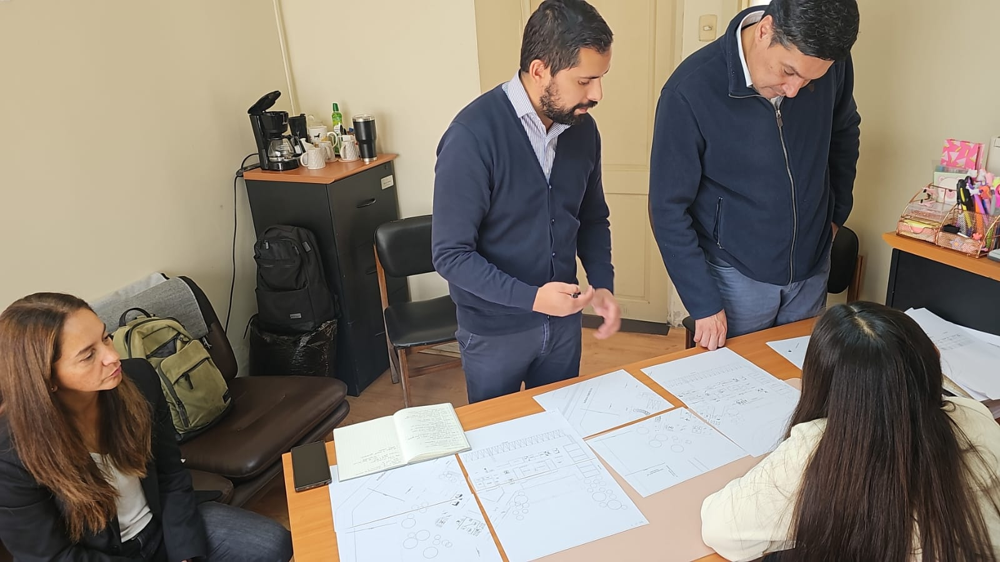

Title: Administrador Zonal de Copiapó y profesionales de Santiago se reúnen por nuevo edificio judicial en Caldera
Date: 2025-03-24 08:00
Category: Zonal
Slug: nuevo-edificio-caldera
Authors: Corporación Administrativa
Summary: En una jornada destinada a potenciar la calidad de vida de los funcionarios y mejorar la atención a los usuarios, el administrador zonal de Copiapó acompañó este lunes a un grupo de profesionales provenientes de Santiago ...

# Administrador Zonal de Copiapó y Profesionales de Santiago se reúnen por nuevo Edificio en Caldera

**Caldera, 24 de marzo de 2025** – En una jornada destinada a potenciar la calidad de vida de los funcionarios y mejorar la atención a los usuarios, el administrador zonal de Copiapó acompañó este lunes a un grupo de profesionales provenientes de Santiago a la localidad de Caldera. La visita se centró en identificar las necesidades y proyectar el nuevo edificio que se erigirá con estándares de arquitectura moderna.

El proyecto contempla la construcción de un inmueble destinado a albergar materias judiciales de **Letras, Garantía y Familia**, lo que promete transformar el entorno laboral y ofrecer espacios adecuados tanto para el personal como para la atención de la ciudadanía. Los profesionales realizaron un levantamiento de información en el sector, clave para definir los requerimientos técnicos y funcionales del futuro edificio.

Durante la jornada, se sostuvo una reunión con la **Dirección de Obras Municipales de Caldera**, en la que se revisaron aspectos fundamentales del proyecto y se definieron las bases para su desarrollo. Esta coordinación entre las distintas instituciones busca asegurar que la construcción no solo cumpla con los más altos estándares arquitectónicos, sino que también se ajuste a las necesidades operativas del Poder Judicial.

> *"La integración de las áreas judiciales en un solo espacio, sumada a la modernización del edificio, representa un avance significativo tanto para los funcionarios como para los usuarios, garantizando un servicio de mayor calidad,"* señaló uno de los participantes durante la reunión.

Con esta iniciativa, se reafirma el compromiso del Poder Judicial y de la administración zonal de Copiapó de invertir en infraestructura que favorezca la eficiencia y el bienestar de todos los involucrados en el sistema judicial.

