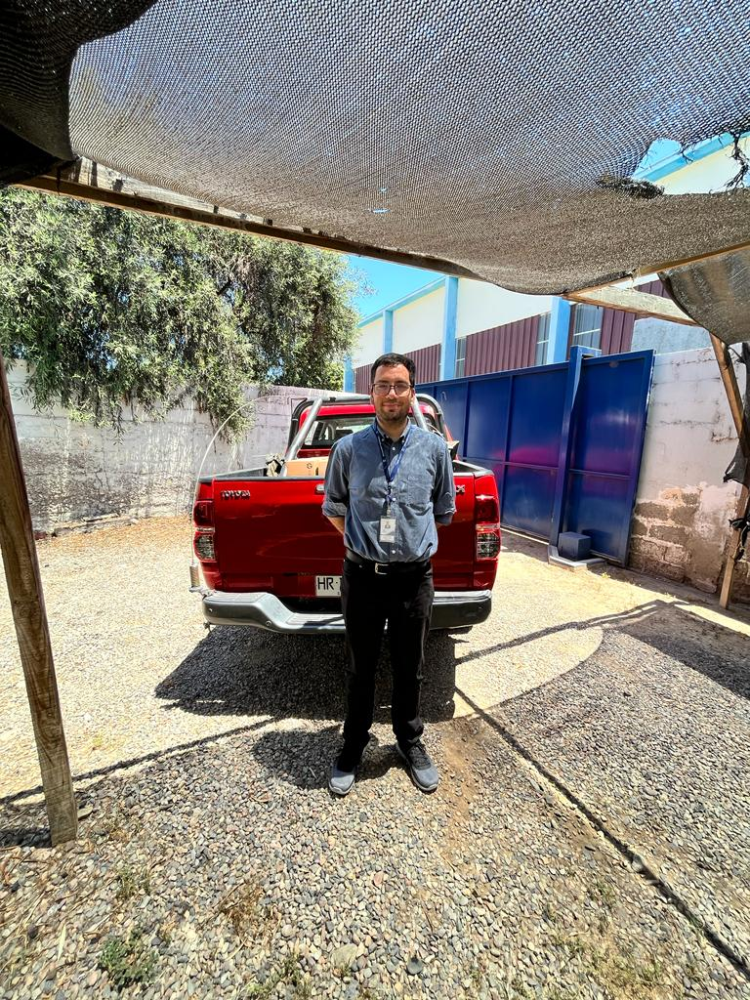

Title: Primera Visita Freirina
Date: 2023-01-25 10:30
Category: informática, Monitoras
Slug: primera-visita-freirina
Authors: Corporación Administrativa
Summary: Primera visita del año realizada al tribunal de Freirina con motivos de retiro de equipos y consultas a monitoras.

# Visita de Monitoras
El día de hoy monitoras informáticas de la Zonal Copiapó concurren al *Juzgado de Letras y Garantía de Frerina* con el motivo de resolver dudas y consultas de lo funcionarios sobre los nuevos procesos que se están desarrollando en las diversas plataformas que estas disponibles.

# Visita de informático 
Informático de la zonal concurre al tribunal con el objetivo de resolver dudas, cargar perfiles y retirar equipos que deben ser dados de bajas ya que se han reemplazados por equipos de última tecnología.
En la visita se aprovechan de resolver dudas con respecto a licitaciones que se encuentran pendientes.
