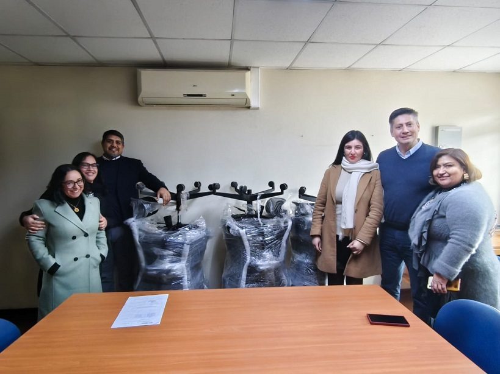

Title: Administrador Zonal de Copiapó Inicia Entrega de Sillas Ergonómicas en la Jurisdicción
Date: 2025-07-30 16:00
Category: Zonal, SSO
Slug: entrega-sillas-ergonomicas-copiapo
Authors: Corporación Administrativa
Summary: El Administrador Zonal Franco Espinoza comenzó la entrega de sillas ergonómicas en la jurisdicción, iniciativa que busca mejorar la calidad de trabajo y la salud de los funcionarios.

**Copiapó, 30 de julio de 2025** – Con el compromiso de seguir avanzando en la **mejora continua y renovación del equipamiento de trabajo**, el **Administrador Zonal de Copiapó, Franco Espinoza**, inició la entrega de **sillas ergonómicas** a los tribunales de la jurisdicción, una medida que busca **brindar mayor comodidad, mejorar la salud postural y optimizar las condiciones laborales** de los funcionarios.

La iniciativa se lleva a cabo en conjunto con el **prevencionista de riesgos Rodrigo Araya**, quien ha acompañado el proceso asegurando que las nuevas sillas cumplan con los estándares ergonómicos necesarios para proteger la salud de los trabajadores.

El **primer tribunal en recibir este equipamiento** fue el **Tribunal de Letras del Trabajo de Copiapó**, donde la **administradora del tribunal, Marianela Cid**, participó en la entrega oficial, destacando la importancia de contar con mobiliario que favorezca el bienestar y la productividad diaria.

> *“La ergonomía no es solo comodidad, es prevención. Estas sillas ayudarán a evitar problemas musculoesqueléticos a largo plazo y a mejorar la calidad de vida en el trabajo”*, destacó el **prevencionista de riesgos Rodrigo Araya**, valorando la iniciativa.

Con esta acción, la jurisdicción de Copiapó da un nuevo paso hacia la **modernización de sus espacios de trabajo** y reafirma su compromiso con la calidad de vida de quienes día a día sostienen el quehacer judicial.

