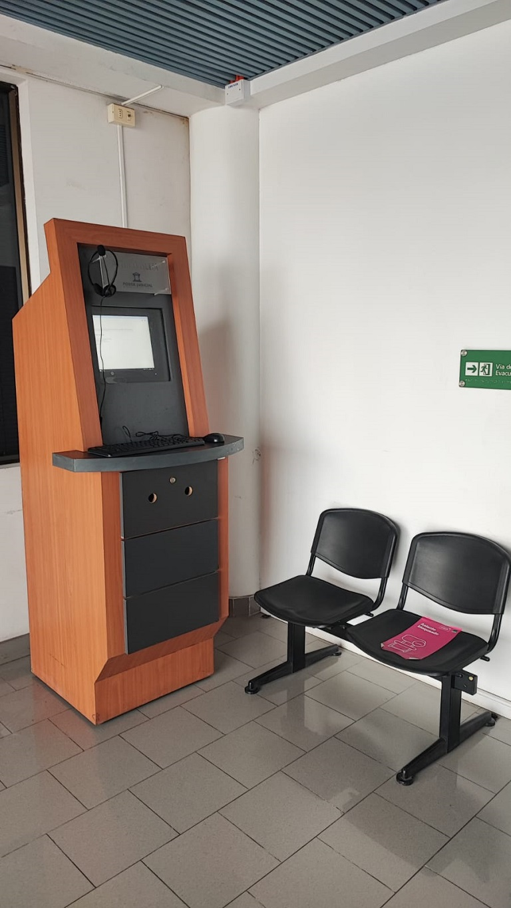

Title: Nuevo tótem de autoatención judicial en la Municipalidad de Huasco
Date: 2025-08-28 09:00
Category: Zonal, Informática
Slug: totem-autoatencion-huasco
Authors: Corporación Administrativa
Summary: La Municipalidad de Huasco, en conjunto con la Corporación Administrativa del Poder Judicial, habilitó un tótem de autoatención que permite a los vecinos acceder a plataformas digitales de justicia.

**Huasco, 28 de agosto de 2025** – Con el propósito de **acercar la justicia a la comunidad**, la **Municipalidad de Huasco**, en conjunto con la **Corporación Administrativa del Poder Judicial**, puso a disposición de la ciudadanía un **tótem de autoatención** en dependencias municipales.

El dispositivo busca ofrecer a los residentes una alternativa práctica para acceder a servicios digitales, tales como:

- [Conecta](https://conecta.pjud.cl/), plataforma que entrega información y acceso a diversos servicios judiciales.  
- [Oficina Judicial Virtual](https://ojv.pjud.cl/kpitec-ojv-web/views/login.html), sistema en línea para la tramitación y consulta de causas.

La iniciativa refuerza el compromiso institucional de modernizar y facilitar el acceso a la justicia, especialmente en sectores alejados de los principales centros urbanos.

> “Esperamos que este servicio, disponible gracias al trabajo conjunto entre la Corporación Administrativa y la Municipalidad de Huasco, sea de gran beneficio para los habitantes de la comuna”, señalaron desde la entidad.

Con esta implementación, se busca **reducir barreras de acceso**, potenciar la atención descentralizada y brindar a los vecinos de Huasco una herramienta tecnológica que les permita realizar trámites y consultas de manera más ágil.

